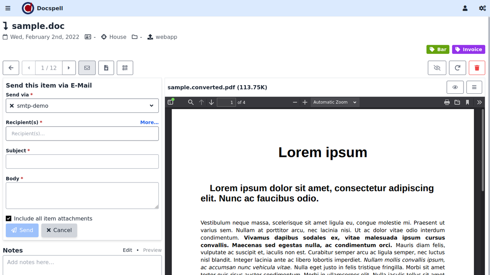
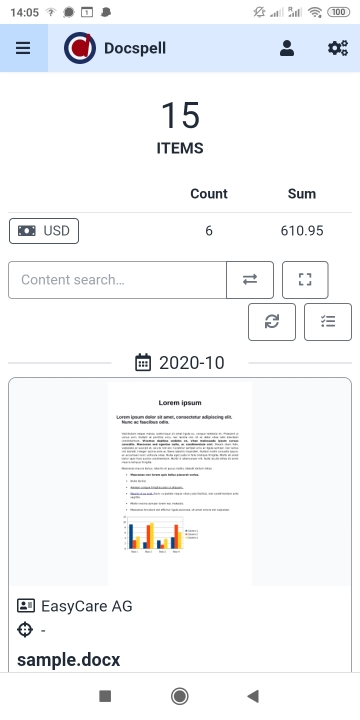
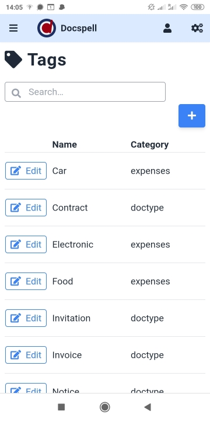

[](https://travis-ci.org/eikek/docspell)
[](https://scala-steward.org)
[](https://github.com/eikek/docspell/blob/master/LICENSE.txt)
[](https://hub.docker.com/r/eikek0/docspell)
[](https://gitter.im/eikek/docspell)

# Docspell

Docspell is a personal document organizer. You'll need a scanner to
convert your papers into files. Docspell can then assist in organizing
the resulting mess :wink:. It is targeted for home use, i.e. families
and households and also for (smaller) groups/companies.

You can associate tags, set correspondends and lots of other
predefined and custom metadata. If your documents are associated with
such meta data, you can quickly find them later using the search
feature. But adding this manually is a tedious task. Docspell can help
by suggesting correspondents, guessing tags or finding dates using
machine learning. It can learn metadata from existing documents and
find things using NLP. This makes adding metadata to your documents a
lot easier. For machine learning, it relies on the free (GPL)
[Stanford Core NLP library](https://github.com/stanfordnlp/CoreNLP).

Docspell also runs OCR (if needed) on your documents, can provide
fulltext search and has great e-mail integration. Everything is
accessible via a REST/HTTP api. A mobile friendly SPA web application
is the default user interface. An [Android
app](https://github.com/docspell/android-client) exists for
conveniently uploading files from your phone/tablet. The [feature
overview](https://docspell.org/#feature-selection) lists some more
points.


## Impressions

Checkout the short demo videos (<1min), present on the [project
page](https://docspell.org/#demos). Here are some screenshots:







## Try it

Docspell consists of several components. The probably quickest way to
get started is to use the docker setup as described in the [get started
page](https://docspell.org/#get-started). This is only three commands
away:

``` shell
git clone https://github.com/eikek/docspell
cd docspell/docker
DOCSPELL_HEADER_VALUE="my-secret-123" docker-compose up
```

Then go to `http://localhost:7880`, sign up and login. Use the same
name for collective and user for now. More on that can be found
[here](https://docspell.org/docs/intro/).

Other ways are documented
[here](https://docspell.org/docs/install/quickstart/):

- Install the [provided](https://github.com/eikek/docspell/releases)
  `deb` file at your debian based system.
- Download [provided](https://github.com/eikek/docspell/releases) zip
  file and run the script in `bin/`, as [described
  here](https://docspell.org/docs/install/installing/#download-unpack-run).
- Using the [nix](https://nixos.org/nix) package manager as [described
  here](https://docspell.org/docs/install/installing/#nix). A NixOS
  module is available, too.


## Documentation

The [project page](https://docspell.org) has lots of information on
how to [use and setup](https://docspell.org/docs) docspell.


## Contributions/Support

Feedback and other contributions are very welcome! There is a [gitter
room](https://gitter.im/eikek/docspell) for chatting and questions.
You can also [open an
issue](https://github.com/eikek/docspell/issues/new) for questions,
problems and other feedback; or make a mail to `info [at]
docspell.org`. I'll try to answer in time. You may want to check
[Contributing.md](Contributing.md) for some starting points, too.

If you find this project any useful and want to support it via other
means, giving a :star: is always encouraging and much appreciated. You
can also support activity by donating via
[liberapay](https://liberapay.com/eikek/) or
[paypal](https://paypal.me/eikek0).

Thank you so much!

## Tech Stack

**Backend**

The servers is written in Scala in a pure functional style, based on
libraries from the [typelevel](https://typelevel.org) stack: Cats,
FS2, Doobie, Http4s, Circe and Pureconfig.

There are more libraries and technologies used, of course. Docspell is
only a orchestration of great tools and libs. One important is the
[Stanford-NLP](https://nlp.stanford.edu/software/), that provides the
ML features. Furthermore, file processing relies on external tools
like tesseract, unoconv and ocrmypdf. All dependencies can be looked
up in `project/Dependencies.scala`.


**Frontend**

The web frontend is a SPA written in [Elm](https://elm-lang.org). The
UI framework in use is [tailwind](https://tailwindcss.com).


## License

Docspell is free software, distributed under the [GPLv3 or
later](https://spdx.org/licenses/GPL-3.0-or-later.html).
