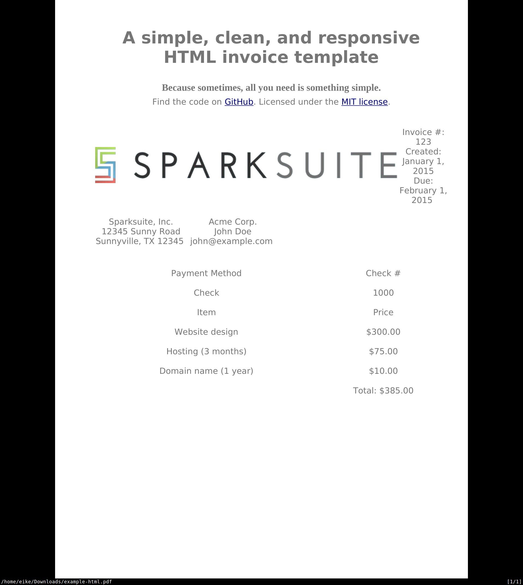

# {{ page.title }}

## Context and Problem Statement

How can HTML documents be converted into a PDF file that looks as much
as possible like the original?

It would be nice to have a java-only solution. But if an external tool
has a better outcome, then an external tool is fine, too.

Since Docspell is free software, the tools must also be free.

## Considered Options

* [pandoc](https://pandoc.org/) external command
* [wkhtmltopdf](https://wkhtmltopdf.org/) external command
* [Unoconv](https://github.com/unoconv/unoconv) external command

Native (firefox) view:

  

Note: the example html is from
[here](https://www.sparksuite.com/open-source/invoice.html).

I downloaded the HTML file to disk together with its resources (using
*Save as...* in the browser).

### Pandoc

  PDF">

  PDF">

Not showing the version using `context` pdf-engine, since it looked
very similiar to the latex variant.

### wkhtmltopdf

  PDF">

### Unoconv

  PDF">

## Decision Outcome

wkhtmltopdf.

It shows the best results.
